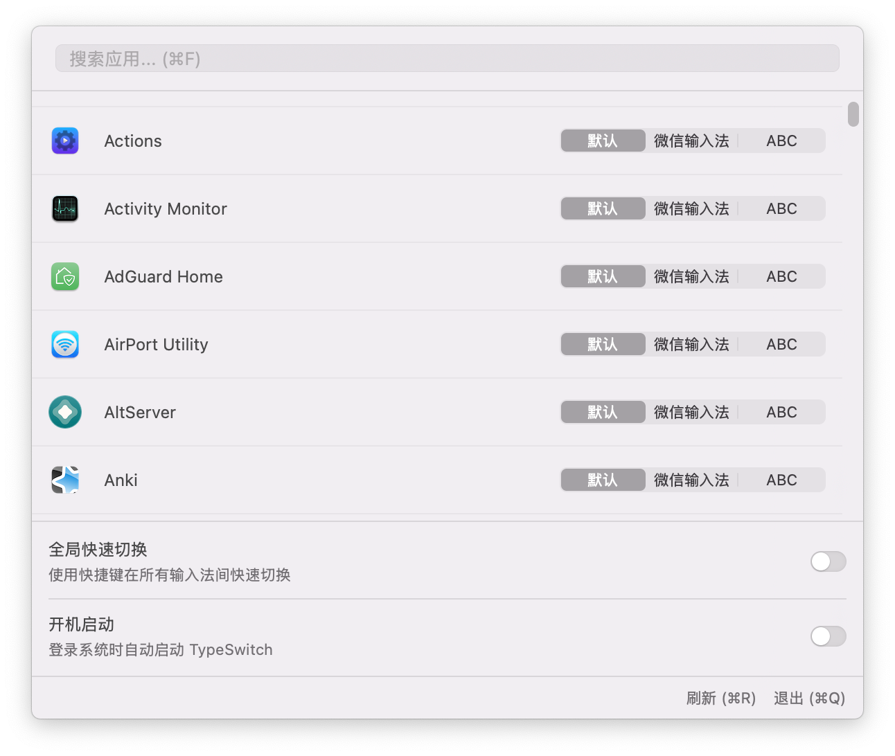
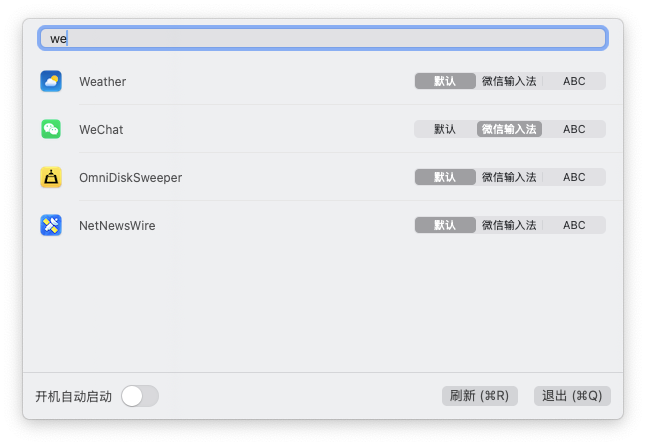

# TypeSwitch 🔄

<div align="center">

[](https://swift.org)
[](https://www.apple.com/macos/)
[](LICENSE)
[](https://github.com/ygsgdbd/TypeSwitch/actions)
[](https://github.com/ygsgdbd/homebrew-tap)
[](https://github.com/ygsgdbd/TypeSwitch/releases)
[](https://github.com/ygsgdbd/TypeSwitch/pulls)

[🇨🇳 中文文档](README.zh-CN.md) | [📦 Installation](#-installation) | [📖 Usage](#-usage)

</div>

TypeSwitch is a modern macOS application built with SwiftUI for automatically switching input methods across different applications. Leveraging the latest Swift features and native macOS capabilities, it provides a seamless and efficient experience for managing input method preferences.

## ✨ Screenshots

<div align="center">
  
  <p><em>Main Interface - Set default input method for different applications</em></p>
</div>

<div align="center">
  
  <p><em>Search Function - Quickly find and configure applications</em></p>
</div>

## 🎯 Features

- 🔄 **Auto Switch**: Automatically switch to preset input methods when changing applications
- 🔍 **Quick Search**: Support fuzzy search for applications
- 🎯 **Precise Match**: Set independent input method preferences for each application
- 🚀 **Auto Start**: Support automatic startup
- ⌨️ **Keyboard Shortcuts**:
  - `⌘ + F` - Quick search applications
  - `⌘ + R` - Refresh application list
  - `⌘ + Q` - Quit application
- 🎯 **Quick Switch**: Support customizable shortcut for switching current application's default input method

## 🔧 System Requirements

- 🖥 macOS 13.0 or later
- 🔐 Accessibility permission for monitoring application switches
- ⌨️ Input method switching permission

## 📦 Installation

### 🍺 Option 1: Homebrew

```bash
# Add tap
brew tap ygsgdbd/tap

# Install application
brew install --cask typeswitch
```

### 💾 Option 2: Manual Installation

1. Download the latest version from [Releases](https://github.com/ygsgdbd/TypeSwitch/releases)
2. Drag the application to Applications folder
3. Grant necessary system permissions on first launch

## 📖 Usage

1. After launching, the app icon appears in the menu bar
2. Click the menu bar icon to open the main interface
3. Find the application you want to configure in the list
4. Select the default input method for the application
5. The input method will automatically switch when you switch to that application

## 🔒 Security

TypeSwitch takes user privacy and security seriously:

- 🏠 All data is stored locally, nothing is uploaded to the network
- 🚫 No user information or usage data is collected
- 📖 Source code is fully open source and welcome for review
- 🛡️ Uses Swift's built-in security features
- 🔐 Permission usage:
  - Accessibility: Only used for detecting application switches
  - Input method switching: Only used for switching input methods
  - Auto-start: Only used for launching at startup

## Dependencies

This project uses the following open source libraries:

- [Defaults](https://github.com/sindresorhus/Defaults) (9.0.0) - For persistent settings storage
- [SwiftUIX](https://github.com/SwiftUIX/SwiftUIX) (0.1.9) - Provides additional SwiftUI components
- [SwifterSwift](https://github.com/SwifterSwift/SwifterSwift) (7.0.0) - Swift native extensions
- [KeyboardShortcuts](https://github.com/sindresorhus/KeyboardShortcuts) (2.2.2) - Add user-customizable global keyboard shortcuts

Build tools:
- [Tuist](https://github.com/tuist/tuist) - For project generation and management

## Development

### Requirements

- Xcode 15.0+
- Swift 5.9+
- macOS 13.0+
- [Tuist](https://github.com/tuist/tuist)

### Build Steps

1. Install [Tuist](https://github.com/tuist/tuist#install-▶️)

2. Clone repository
```bash
git clone https://github.com/ygsgdbd/TypeSwitch.git
cd TypeSwitch
```

3. Generate Xcode project
```bash
tuist generate
```

4. Open and build
```bash
open TypeSwitch.xcworkspace
```

### Automated Build and Release

This project uses GitHub Actions for automated building and releasing:

1. Push a new version tag to trigger automatic build:
```bash
git tag v1.0.0
git push origin v1.0.0
```

2. GitHub Actions will automatically:
   - Build the application
   - Create DMG package
   - Release new version
   - Generate changelog

3. Build artifacts can be downloaded from [Releases](https://github.com/ygsgdbd/TypeSwitch/releases)

### Project Structure

```
TypeSwitch/
├── Project.swift       # Tuist project configuration
├── Tuist/             # Tuist configuration files
├── Sources/           # Source code
│   ├── Models/        # Data models
│   ├── Views/         # SwiftUI views
│   ├── ViewModels/    # View models
│   └── Utils/         # Utility classes
└── Tests/            # Test files
```

## Contributing

Pull requests and issues are welcome. Before submitting a PR, please ensure:

1. Code follows project style
2. Necessary tests are added
3. Documentation is updated

## License

This project is licensed under the MIT License. See [LICENSE](LICENSE) file for details.

## Acknowledgments 🙏

This project was inspired by and received help from:
- [SwitchKey](https://github.com/itsuhane/SwitchKey) - An excellent input method switcher that provided valuable reference
- Swift and SwiftUI community
- All contributors and users who provided feedback
