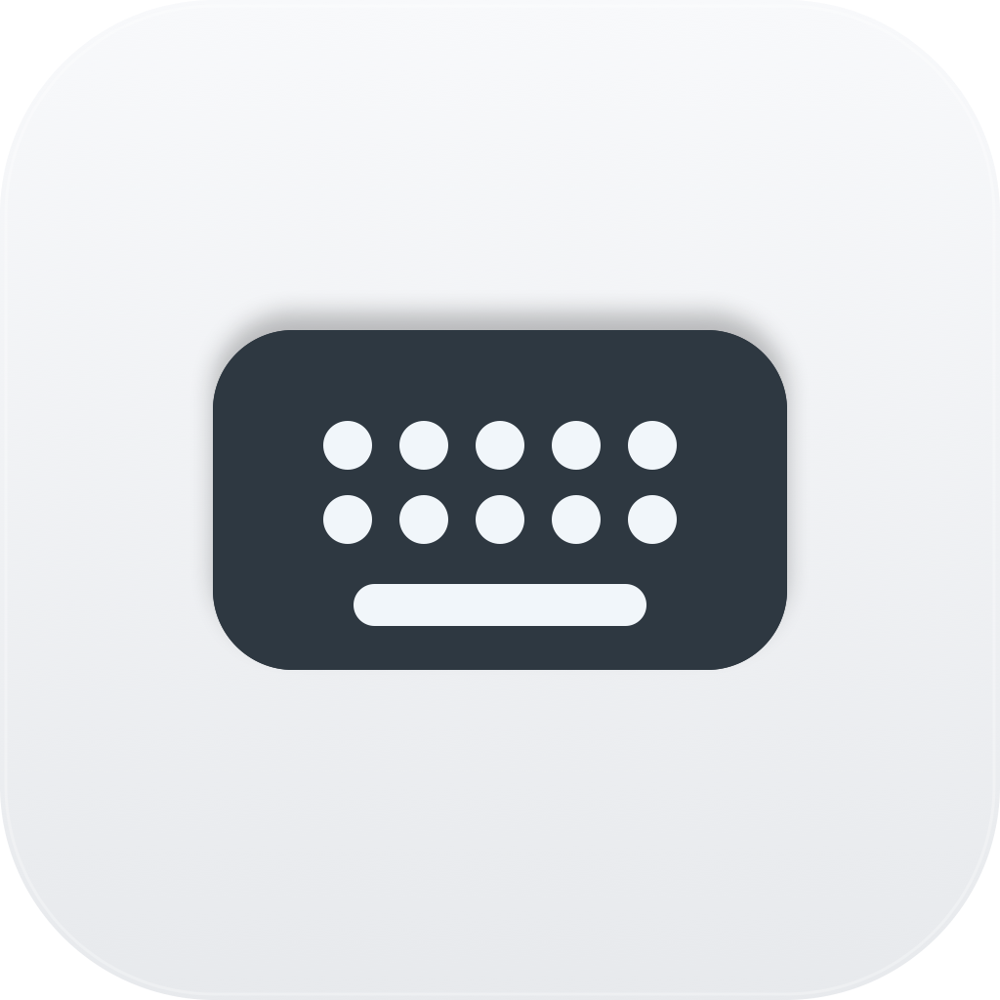

<p align="center">
  <picture>
    <source media="(prefers-color-scheme: dark)" srcset="Design/AppIcon/Previews/typeswitch-icon-dark.png">
    <source media="(prefers-color-scheme: light)" srcset="Design/AppIcon/Previews/typeswitch-icon-default.png">
    
  </picture>
</p>

<h1 align="center">TypeSwitch</h1>

<p align="center">TypeSwitch is a native macOS menu bar utility for switching input methods per app. Choose how each app should behave, set the rule for unconfigured apps, and let TypeSwitch switch to the right input method when the frontmost app changes.</p>

<p align="center">
  <a href="https://swift.org"></a>
  <a href="https://www.apple.com/macos/"></a>
  <a href="LICENSE"></a>
  <a href="https://github.com/ygsgdbd/homebrew-tap"></a>
  <a href="https://github.com/ygsgdbd/TypeSwitch/releases"></a>
  <a href="https://github.com/ygsgdbd/TypeSwitch/pulls"></a>
</p>

<p align="center">🇨🇳 <a href="README.zh-CN.md">简体中文</a> · 🇺🇸 <strong>English</strong></p>

## 🖼️ Screenshots


## ✨ Highlights

- **Switch automatically for every app.** TypeSwitch watches the frontmost app and applies its saved input method rule as you move between apps.
- **Choose the behavior that fits.** Use `Don't Switch`, `Last Switch`, or a `Specific Input Method`, with a separate default rule for apps you have not configured yet.
- **Configure apps where you find them.** Set a rule for the current app, review running apps by configuration status, or manage every saved rule without leaving the menu bar.
- **Keep rules and results tidy.** Find rules for missing apps, remove stale settings, review successful switch counts, and clear statistics when needed.
- **Fit TypeSwitch into your workflow.** Launch it at login, check for updates through Sparkle, open the GitHub repository, or press `Command + Q` to quit.

## 🪶 Native and Lightweight

- **Truly native.** TypeSwitch's app business code is written in Swift and built with SwiftUI and The Composable Architecture (TCA). It uses `MenuBarExtra` and `LSUIElement` instead of an Electron runtime or embedded WebView.
- **Focused and lightweight.** TypeSwitch runs as a menu bar utility without shipping a browser engine or server component. App rules, the default rule, and switch statistics stay on your Mac.
- **At home on macOS.** The interface follows Light and Dark Mode automatically. On macOS 26, native SwiftUI controls use the system-provided Liquid Glass appearance where appropriate, while macOS 14 and macOS 15 retain their native system styling. TypeSwitch does not simulate Liquid Glass with custom visual effects.
- **Built for modern Macs.** The release workflow uses Xcode 26.2 and verifies every release as a Universal Binary for both Apple Silicon and Intel Macs.

## 💻 System Requirements

- macOS 14.0 or later
- Enabled macOS keyboard layouts or input methods
- macOS permissions needed for app activation monitoring, system input method switching, and optional Login Items

## 📦 Installation

### Homebrew

The `brew trust` command first shipped with Homebrew 5.1.15 on June 3, 2026. In Homebrew 5.1.15 through 5.x, trust was required only when `HOMEBREW_REQUIRE_TAP_TRUST=1` was set. Starting with Homebrew 6.0.0 on June 11, 2026, casks from non-official taps require explicit trust by default.

```bash
brew tap ygsgdbd/tap
brew trust --cask ygsgdbd/tap/typeswitch
brew install --cask typeswitch
```

This trusts only the `typeswitch` cask, not the entire tap. Homebrew stores the trust entry, so you normally need to run the trust command only once. See Homebrew's [Tap Trust documentation](https://docs.brew.sh/Tap-Trust) for details.

Homebrew 5.1.14 and earlier do not have `brew trust` and do not require it:

```bash
brew tap ygsgdbd/tap
brew install --cask typeswitch
```

If `brew trust` reports `Unknown command: trust`, skip that command or run `brew update` to upgrade Homebrew.

Update Homebrew installations with:

```bash
brew upgrade typeswitch
```

#### Tap Trust Troubleshooting

- If Homebrew reports `Refusing to load cask ... from untrusted tap`, run `brew trust --cask ygsgdbd/tap/typeswitch`, then retry the installation or upgrade.
- If `brew doctor` reports that `ygsgdbd/tap` is untrusted, trust only the TypeSwitch cask with the command above; trusting the entire tap is not required.
- If an existing installation stops upgrading after Homebrew is updated to 6.0.0 or later, trust the cask and retry `brew upgrade typeswitch`.
- To trust every current and future formula, cask, and external command in the tap, use `brew trust ygsgdbd/tap`. This grants broader access and is not the recommended option.

### Manual Installation

1. Download the latest build from [Releases](https://github.com/ygsgdbd/TypeSwitch/releases).
2. Drag `TypeSwitch.app` to the Applications folder.
3. Launch TypeSwitch and grant any system permissions macOS requests.
4. Use `Check for Updates…` from the menu bar app to check GitHub Releases for future updates.

## 🧭 Usage

1. Launch TypeSwitch. Its keyboard icon appears in the menu bar.
2. Open the menu and use `Current App` to configure the frontmost app.
3. Use `Running · Unconfigured` to assign rules to running apps that do not have one yet.
4. Use `Running · Configured` and `All Configured Apps` to review and change existing app rules.
5. For each app, choose `Default`, `Last Switch`, `Don't Switch`, or a specific input method.
6. Use `Default Rule for Unconfigured Apps` to set the fallback behavior for apps without their own rule.
7. Check `Missing Apps` and `Switches` when you want to clean missing rules or review successful switches.

## 🔒 Privacy and Permissions

- App rules, the Default Rule for Unconfigured Apps, and switch statistics are stored locally.
- TypeSwitch has no server-side component in this repository.
- `GitHub Repository` and `Check for Updates…` contact GitHub only when you use them.
- Input method switching uses macOS system input sources.
- Launch at Login uses macOS Login Items, with a LaunchAgent fallback when needed.

## 🧰 Tech Stack

This project uses:

- [The Composable Architecture](https://github.com/pointfreeco/swift-composable-architecture) `1.26.0` for app architecture and state management
- [Sharing](https://github.com/pointfreeco/swift-sharing) `2.9.1` for file-backed shared state
- [Sparkle](https://github.com/sparkle-project/Sparkle) `2.9.4` for manual update checks and appcast support
- [SwifterSwift](https://github.com/SwifterSwift/SwifterSwift) `8.0.0` for Swift extensions
- Point-Free support libraries: CasePaths, Dependencies, and PerceptionCore
- [Tuist](https://github.com/tuist/tuist) for project generation and build configuration

## 🧪 Development

### Requirements

- Xcode 15.0+
- Swift 5.9+
- macOS 14.0+
- [Tuist](https://github.com/tuist/tuist)
- [ImageMagick](https://imagemagick.org/)
- RTK (`rtk`, required by the screenshot generation script)

### Build Steps

Install Tuist:

```bash
brew tap tuist/tuist
brew install --formula tuist
```

Clone and generate the Xcode project:

```bash
git clone https://github.com/ygsgdbd/TypeSwitch.git
cd TypeSwitch
tuist generate
open TypeSwitch.xcworkspace
```

Run tests:

```bash
tuist test
```

To regenerate the deterministic, privacy-safe README screenshots, grant your terminal or Codex Screen Recording and Accessibility permissions, quit other running TypeSwitch instances, and run:

```bash
./script/generate_readme_screenshots.sh
```

### Release Workflow

Production releases are built by GitHub Actions when a `vX.Y.Z` tag is pushed:

```bash
git tag v0.6.0
git push origin v0.6.0
```

The workflow validates the tag, runs tests, builds a universal macOS app, packages a zip, generates checksums, creates a signed Sparkle `appcast.xml`, publishes a GitHub Release, and updates the Homebrew cask.

## 🙏 Acknowledgments

TypeSwitch was inspired by:

- [SwitchKey](https://github.com/itsuhane/SwitchKey), an input method switcher for macOS
- The Swift and SwiftUI community
- Contributors and users who shared feedback
