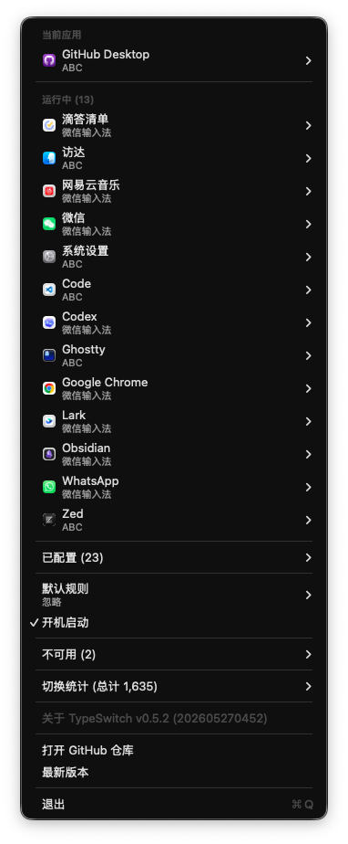

# TypeSwitch 🔄

<div align="center">

[](https://swift.org)
[](https://www.apple.com/macos/)
[](LICENSE)
[](https://github.com/ygsgdbd/homebrew-tap)
[](https://github.com/ygsgdbd/TypeSwitch/releases)
[](https://github.com/ygsgdbd/TypeSwitch/pulls)

[🇨🇳 中文文档](README.zh-CN.md) | [📦 Installation](#-installation) | [📖 Usage](#-usage)

</div>

TypeSwitch is a macOS menu bar utility for switching input methods per app.

✨ **System-native appearance** - TypeSwitch uses SwiftUI menu bar controls and follows macOS light and dark mode.

## ✨ Screenshots

<div align="center">
  
  <p><em>Menu bar interface - manage app rules, default rule, unavailable apps, and switch statistics</em></p>
</div>


## 🎯 Features

- 🔄 **Auto Switch**: Switch input methods when changing apps
- 🧭 **Current App**: Configure the frontmost app at the top of the menu
- 📱 **Menu Bar Interface**: View and set rules quickly
- 📋 **Running Apps**: Configure open apps directly
- ⚙️ **Configured Apps**: Manage saved app rules
- 🎯 **Default Rule**: Set the fallback strategy for apps without their own rule
- 🧹 **Unavailable Apps**: Review and clean up rules for missing apps
- 📊 **Switch Statistics**: Track successful switches per app and clear the counts
- 🚀 **Launch at Login**: Run automatically after login
- ⌨️ **Keyboard Shortcuts**:
  - `⌘ + Q` - Quit application
- 🔗 **Quick Links**: Direct access to GitHub repository and latest releases

## 🔧 System Requirements

- 🖥 macOS 14.0 or later
- 🔐 Accessibility permission for monitoring application switches
- ⌨️ Input method switching permission

## 📦 Installation

### 🍺 Option 1: Homebrew

```bash
brew install ygsgdbd/tap/typeswitch --cask
```

### 💾 Option 2: Manual Installation

1. Download the latest version from [Releases](https://github.com/ygsgdbd/TypeSwitch/releases)
2. Drag the application to Applications folder
3. Grant necessary system permissions on first launch

## 📖 Usage

1. After launching, the app icon (⌨️) appears in the menu bar
2. Click the menu bar icon to open the dropdown menu
3. Use Current App or Running Apps to configure the active or open apps
4. Use Configured Apps to manage saved app rules
5. Choose Default, Remember Last, Ignore, or a fixed input method
6. Set the Default Rule and Launch at Login from the main menu
7. Review Unavailable Apps and Switch Statistics when needed

## 🔒 Security

TypeSwitch takes user privacy and security seriously:

- 🏠 All data is stored locally, nothing is uploaded to the network
- 🚫 No user information or usage data is collected
- 📖 Source code is fully open source and welcome for review
- 🛡️ Uses Swift's built-in security features
- 🔐 Permission usage:
  - Accessibility: Only used for detecting application switches
  - Input method switching: Only used for switching input methods
  - Auto-start: Only used for launching at startup

## Dependencies

This project uses the following open source libraries:

- [Defaults](https://github.com/sindresorhus/Defaults) (7.3.1) - For persistent settings storage
- [SwiftUIX](https://github.com/SwiftUIX/SwiftUIX) (0.2.3) - Provides additional SwiftUI components
- [SwifterSwift](https://github.com/SwifterSwift/SwifterSwift) (8.0.0) - Swift native extensions

Build tools:
- [Tuist](https://github.com/tuist/tuist) - For project generation and management

## Development

### Requirements

- Xcode 15.0+
- Swift 5.9+
- macOS 14.0+
- [Tuist](https://github.com/tuist/tuist)

### Build Steps

1. Install [Tuist](https://github.com/tuist/tuist#install-▶️)

2. Clone repository
```bash
git clone https://github.com/ygsgdbd/TypeSwitch.git
cd TypeSwitch
```

3. Generate Xcode project
```bash
tuist generate
```

4. Open and build
```bash
open TypeSwitch.xcworkspace
```

### Automated Build and Release

This project uses GitHub Actions for automated building and releasing:

1. Push a new version tag to trigger automatic build:
```bash
git tag v1.0.0
git push origin v1.0.0
```

2. GitHub Actions will automatically:
   - Build the application
   - Create DMG package
   - Release new version
   - Generate changelog

3. Build artifacts can be downloaded from [Releases](https://github.com/ygsgdbd/TypeSwitch/releases)

## Contributing

Pull requests and issues are welcome. Before submitting a PR, please ensure:

1. Code follows project style
2. Necessary tests are added
3. Documentation is updated

## License

This project is licensed under the MIT License. See [LICENSE](LICENSE) file for details.

## Acknowledgments 🙏

This project was inspired by and received help from:
- [SwitchKey](https://github.com/itsuhane/SwitchKey) - An excellent input method switcher that provided valuable reference
- Swift and SwiftUI community
- All contributors and users who provided feedback
