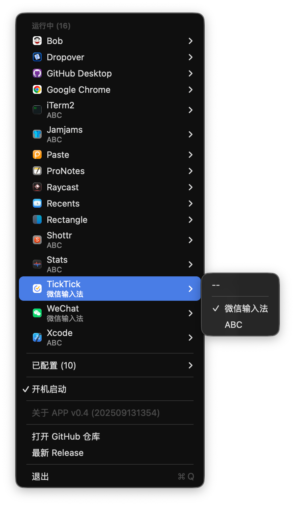

# TypeSwitch

[](https://swift.org)
[](https://www.apple.com/macos/)
[](LICENSE)
[](https://github.com/yourusername/TypeSwitch/actions)

TypeSwitch 是一个 macOS 应用程序，用于自动切换不同应用的输入法。它可以记住每个应用程序的输入法偏好，并在应用程序切换时自动切换到对应的输入法。

## 截图预览

<div align="center">
  
  <p><em>主界面 - 为不同应用设置默认输入法</em></p>
</div>

<div align="center">
  
  <p><em>搜索功能 - 快速查找应用并设置输入法</em></p>
</div>

## 功能特点

- 🔄 自动切换：在切换应用时自动切换到预设的输入法
- 🔍 快速搜索：支持模糊搜索应用程序
- 🎯 精确匹配：为每个应用设置独立的输入法偏好
- 🚀 开机启动：支持开机自动启动
- ⌨️ 快捷键支持：
  - `Com + F` - 快速搜索应用
  - `Com + R` - 刷新应用列表
  - `Com + Q` - 退出应用

## 系统要求

- macOS 13.0 或更高版本
- 需要辅助功能权限以监听应用切换
- 需要输入法切换权限

## 安装方法

1. 从 [Releases](https://github.com/yourusername/TypeSwitch/releases) 页面下载最新版本
2. 将应用拖入 Applications 文件夹
3. 首次运行时授予必要的系统权限

## 使用说明

1. 启动应用后，会在菜单栏显示图标
2. 点击菜单栏图标打开主界面
3. 在列表中找到需要设置的应用
4. 为应用选择默认输入法
5. 设置完成后，切换到该应用时会自动切换到设定的输入法

## 安全说明

TypeSwitch 高度重视用户隐私和安全：

- 所有数据均存储在本地，不会上传到网络
- 不收集任何用户信息或使用数据
- 源代码完全开源，欢迎审查
- 使用 Swift 内置的安全特性，确保类型安全
- 权限使用说明：
  - 辅助功能权限：仅用于检测应用程序切换
  - 输入法切换权限：仅用于切换输入法
  - 开机自启动权限：仅用于开机启动应用

## 依赖说明

本项目使用以下开源库：

- [Defaults](https://github.com/sindresorhus/Defaults) (9.0.0) - 用于持久化存储设置
- [SwiftUIX](https://github.com/SwiftUIX/SwiftUIX) (0.2.3) - 提供额外的 SwiftUI 组件
- [Swift Syntax](https://github.com/swiftlang/swift-syntax) (600.0.1) - 用于项目生成

构建工具：
- [Tuist](https://github.com/tuist/tuist) - 用于项目生成和管理

## 开发相关

### 环境要求

- Xcode 15.0+
- Swift 5.9+
- macOS 13.0+
- [Tuist](https://github.com/tuist/tuist)

### 构建步骤

1. 安装 [Tuist](https://github.com/tuist/tuist#install-▶️)

2. 克隆仓库
```bash
git clone https://github.com/yourusername/TypeSwitch.git
cd TypeSwitch
```

3. 生成 Xcode 项目
```bash
tuist generate
```

4. 打开项目并构建
```bash
open TypeSwitch.xcworkspace
```

### 自动构建和发布

本项目使用 GitHub Actions 进行自动构建和发布：

1. 推送新的版本标签会触发自动构建：
```bash
git tag v1.0.0
git push origin v1.0.0
```

2. GitHub Actions 会自动：
   - 构建应用
   - 创建 DMG 安装包
   - 发布新版本
   - 生成更新日志

3. 构建产物可在 [Releases](https://github.com/yourusername/TypeSwitch/releases) 页面下载

### 项目结构

```
TypeSwitch/
├── Project.swift       # Tuist 项目配置
├── Tuist/             # Tuist 配置文件
├── Sources/           # 源代码
│   ├── Models/        # 数据模型
│   ├── Views/         # SwiftUI 视图
│   ├── ViewModels/    # 视图模型
│   └── Utils/         # 工具类
└── Tests/            # 测试文件
```

## 贡献指南

欢迎提交 Pull Request 或创建 Issue，在提交 PR 之前，请确保：

1. 代码符合项目的代码风格
2. 添加了必要的测试
3. 更新了相关文档

## 许可证

本项目采用 MIT 许可证。详见 [LICENSE](LICENSE) 文件。
