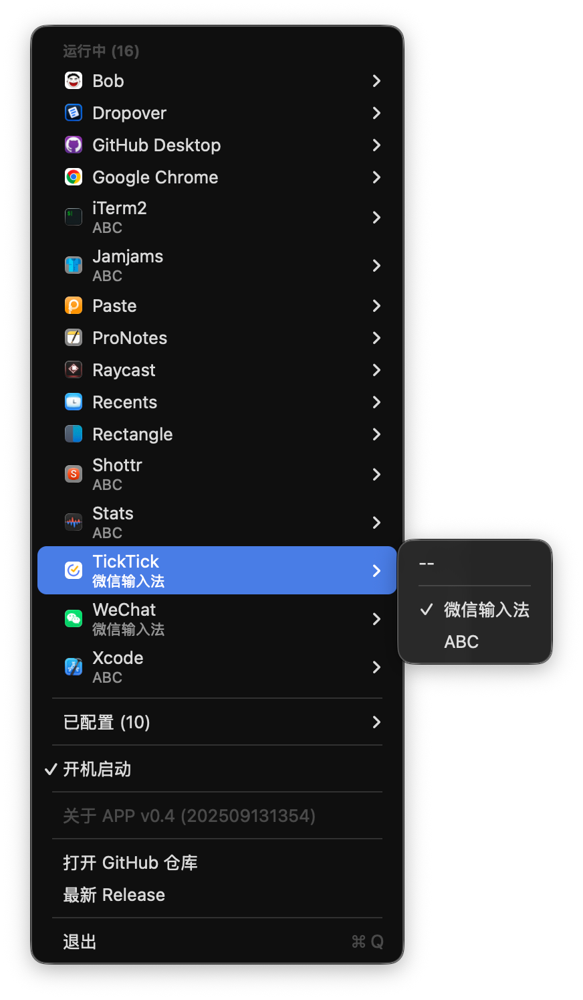

# TypeSwitch 🔄

<div align="center">

[](https://swift.org)
[](https://www.apple.com/macos/)
[](LICENSE)
[](https://github.com/ygsgdbd/homebrew-tap)
[](https://github.com/ygsgdbd/TypeSwitch/releases)
[](https://github.com/ygsgdbd/TypeSwitch/pulls)

[🇺🇸 English](README.md) | [📦 安装方法](#安装方法) | [📖 使用说明](#使用说明)

</div>

TypeSwitch 是一个基于 SwiftUI 开发的现代 macOS 菜单栏应用，用于自动切换不同应用的输入法。应用在后台静默运行，通过优雅的菜单栏界面为每个应用管理输入法偏好设置。

✨ **支持 macOS 26 液态玻璃设计** - 体验美观的半透明界面，采用先进的 macOS 26 液态玻璃效果，创造优雅现代的用户体验，与系统完美融合。

## 截图预览

<div align="center">
  
  <p><em>菜单栏界面 - 为不同应用设置默认输入法</em></p>
</div>


## 功能特点

- 🔄 自动切换：在切换应用时自动切换到预设的输入法
- 📱 菜单栏界面：简洁直观的菜单栏界面，方便快速访问
- 🎯 按应用设置：为每个应用设置独立的输入法偏好
- 🚀 开机启动：支持开机自动启动
- 📋 运行中应用：查看和配置当前运行的应用
- ⚙️ 已安装应用：管理所有已安装应用的输入法设置
- ⌨️ 快捷键支持：
  - `⌘ + Q` - 退出应用
- 🔗 快速链接：直接访问 GitHub 仓库和最新发布版本

## 系统要求

- 🖥 macOS 13.0 或更高版本（兼容至 macOS 26）
- 🔐 需要辅助功能权限用于监控应用切换
- ⌨️ 需要输入法切换权限

## 安装方法

### 🍺 方式一：Homebrew

```bash
# 添加 tap
brew tap ygsgdbd/tap

# 安装应用
brew install --cask typeswitch
```

### 💾 方式二：手动安装

1. 从 [Releases](https://github.com/ygsgdbd/TypeSwitch/releases) 下载最新版本
2. 将应用拖入应用程序文件夹
3. 首次启动时授予必要系统权限

## 使用���明

1. 启动后，应用图标（⌨️）会出现在菜单栏中
2. 点击菜单栏图标打开下拉菜单
3. 菜单显示两个部分：
   - **运行中应用**：当前正在运行的应用
   - **已配置应用**：已设置输入法的应用
4. 点击任意应用来设置其输入法：
   - 选择"默认"使用系统默认输入法
   - 选择任意已安装的输入法作为该应用的默认输入法
5. 当切换到该应用时，输入法会自动切换
6. 使用设置部分可以启用开机自动启动

## 🔒 安全

TypeSwitch 非常重视用户隐私和安全：

- 🏠 所有数据本地存储，不会上传网络
- 🚫 不收集任何用户信息或使用数据
- 📖 源代码完全开放，欢迎审查
- 🛡️ 使用 Swift 内置的安全特性
- 🔐 权限使用说明：
  - 辅助功能：仅用于检测应用切换
  - 输入法切换：仅用于切换输入法
  - 自动启动：仅用于开机启动

## 依赖说明

本项目使用以下开源库：

- [Defaults](https://github.com/sindresorhus/Defaults) (7.3.1) - 用于持久化存储设置
- [SwiftUIX](https://github.com/SwiftUIX/SwiftUIX) (0.2.3) - 提供额外的 SwiftUI 组件
- [SwifterSwift](https://github.com/SwifterSwift/SwifterSwift) (8.0.0) - Swift 原生扩展

构建工具：
- [Tuist](https://github.com/tuist/tuist) - 用于项目生成和管理

## 开发相关

### 环境要求

- Xcode 15.0+
- Swift 5.9+
- macOS 13.0+（兼容至 macOS 26）
- [Tuist](https://github.com/tuist/tuist)

### 构建步骤

1. 安装 [Tuist](https://github.com/tuist/tuist#install-▶️)

2. 克隆仓库
```bash
git clone https://github.com/ygsgdbd/TypeSwitch.git
cd TypeSwitch
```

3. 生成 Xcode 项目
```bash
tuist generate
```

4. 打开项目并构建
```bash
open TypeSwitch.xcworkspace
```

### 自动构建和发布

本项目使用 GitHub Actions 进行自动构建和发布：

1. 推送新的版本标签会触发自动构建：
```bash
git tag v1.0.0
git push origin v1.0.0
```

2. GitHub Actions 会自动：
   - 构建应用
   - 创建 DMG 安装包
   - 发布新版本
   - 生成更新日志

3. 构建产物可在 [Releases](https://github.com/ygsgdbd/TypeSwitch/releases) 页面下载

### 项目结构

```
TypeSwitch/
├── Project.swift       # Tuist 项目配置
├── Tuist/             # Tuist 配置文件
├── Sources/           # 源代码
│   ├── Models/        # 数据模型
│   ├── Views/         # SwiftUI 视图
│   ├── ViewModels/    # 视图模型
│   └── Utils/         # 工具类
└── Tests/            # 测试文件
```

## 贡献指南

欢迎提交 Pull Request 和创建 Issue，在提交 PR 之前，请确保：

1. 代码符合项目的代码风格
2. 添加了必要的测试
3. 更新了相关文档

## 许可证

本项目基于 MIT 许可证开源。详见 [LICENSE](LICENSE) 文件。

## 致谢 🙏

本项目受到以下项目和社区的启发和帮助：
- [SwitchKey](https://github.com/itsuhane/SwitchKey) - 一个优秀的输入法切换工具，为本项目提供了宝贵的参考
- Swift 和 SwiftUI 社区
- 所有提供反馈和贡献者和用户
