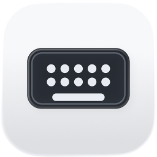

<p align="center">
  
</p>

<h1 align="center">TypeSwitch</h1>

<hr>

<p align="center">TypeSwitch 是一款按 App 自动切换输入法的 macOS 菜单栏工具。为每个 App 选择输入法策略，设置未配置应用规则，并在前台 App 切换时自动切到对应输入法。</p>

<p align="center">
  <a href="https://swift.org"></a>
  <a href="https://www.apple.com/macos/"></a>
  <a href="LICENSE"></a>
  <a href="https://github.com/ygsgdbd/homebrew-tap"></a>
  <a href="https://github.com/ygsgdbd/TypeSwitch/releases"></a>
  <a href="https://github.com/ygsgdbd/TypeSwitch/pulls"></a>
</p>

<p align="center"><strong>简体中文</strong> • <a href="README.md">English</a></p>

## 截图预览


## 功能特点

- **按 App 自动切换**：当前 App 变化时自动切换输入法。
- **当前应用**：在菜单顶部直接配置当前前台 App。
- **未配置与运行中分组**：将没有规则的运行中 App 与已有规则的运行中 App 分开查看。
- **已配置应用**：在菜单栏中管理已保存的 App 规则。
- **未配置应用规则**：设置没有单独规则的 App 应该如何处理。
- **规则策略**：可选择“不自动切换”、“记住上次切换”或“指定输入法”。
- **不可用项清理**：查看不存在 App 的规则，并清理失效设置。
- **切换统计**：按 App 记录成功切换次数，并可清零统计。
- **开机启动**：登录后自动运行，macOS 需要批准时可直接打开登录项设置。
- **手动检查更新**：手动安装版可在菜单栏应用里使用“检查更新...”。
- **项目入口**：从菜单直接打开 GitHub 仓库。
- **快捷键**：按 `Command + Q` 退出 TypeSwitch。

## 系统要求

- macOS 14.0 或更高版本
- 已启用的 macOS 键盘布局或输入法
- macOS 对应用激活监听、系统输入法切换和可选登录项所需的权限

## 安装方法

### Homebrew

```bash
brew install ygsgdbd/tap/typeswitch --cask
```

Homebrew 安装版使用以下命令更新：

```bash
brew upgrade typeswitch
```

### 手动安装

1. 从 [Releases](https://github.com/ygsgdbd/TypeSwitch/releases) 下载最新构建。
2. 将 `TypeSwitch.app` 拖入“应用程序”文件夹。
3. 启动 TypeSwitch，并授予 macOS 请求的系统权限。
4. 后续可在菜单栏应用中使用“检查更新...”从 GitHub Releases 检查更新。

## 使用说明

1. 启动 TypeSwitch，键盘图标会出现在菜单栏中。
2. 打开菜单，用“当前应用”配置当前前台 App。
3. 用“未配置”为还没有规则的运行中 App 设置规则。
4. 用“运行中”和“已配置”查看并修改已有 App 规则。
5. 为每个 App 选择“默认”、“记住上次切换”、“不自动切换”或指定输入法。
6. 用“未配置应用规则”设置没有单独规则的 App 的默认行为。
7. 按需查看“不可用”和“切换统计”，清理缺失规则或查看成功切换次数。

## 隐私与权限

- App 规则、未配置应用规则和切换统计都存储在本地。
- 本仓库中没有服务端组件。
- 菜单中的 GitHub 链接和“检查更新...”只会在你主动使用时访问 GitHub。
- 输入法切换使用 macOS 系统输入源。
- 开机启动使用 macOS 登录项；必要时会回退到 LaunchAgent。

## 技术栈

本项目使用：

- [The Composable Architecture](https://github.com/pointfreeco/swift-composable-architecture) `1.26.0`：应用架构和状态管理
- [Sharing](https://github.com/pointfreeco/swift-sharing) `2.9.1`：基于文件的共享状态持久化
- [Sparkle](https://github.com/sparkle-project/Sparkle) `2.9.4`：手动检查更新和 appcast 支持
- [SwifterSwift](https://github.com/SwifterSwift/SwifterSwift) `8.0.0`：Swift 扩展
- Point-Free 支持库：CasePaths、Dependencies、PerceptionCore
- [Tuist](https://github.com/tuist/tuist)：项目生成和构建配置

## 开发相关

### 环境要求

- Xcode 15.0+
- Swift 5.9+
- macOS 14.0+
- [Tuist](https://github.com/tuist/tuist)
- [ImageMagick](https://imagemagick.org/)
- RTK（`rtk`，截图生成脚本需要）

### 构建步骤

安装 Tuist：

```bash
brew tap tuist/tuist
brew install --formula tuist
```

克隆仓库并生成 Xcode 项目：

```bash
git clone https://github.com/ygsgdbd/TypeSwitch.git
cd TypeSwitch
tuist generate
open TypeSwitch.xcworkspace
```

运行测试：

```bash
tuist test
```

如需重新生成内容固定且不包含用户真实规则、输入法或统计信息的 README 截图，请先为终端或 Codex 授予“屏幕与系统音频录制”和“辅助功能”权限，退出其他正在运行的 TypeSwitch 实例，然后执行：

```bash
./script/generate_readme_screenshots.sh
```

### 发布流程

推送 `vX.Y.Z` 标签后，GitHub Actions 会构建正式版本：

```bash
git tag v0.6.0
git push origin v0.6.0
```

发布 workflow 会校验标签、运行测试、构建 universal macOS app、打包 zip、生成 checksums、创建已签名的 Sparkle `appcast.xml`、发布 GitHub Release，并更新 Homebrew cask。

## 致谢

TypeSwitch 受到以下项目和社区启发：

- [SwitchKey](https://github.com/itsuhane/SwitchKey)，一款 macOS 输入法切换工具
- Swift 和 SwiftUI 社区
- 提供反馈的贡献者和用户
